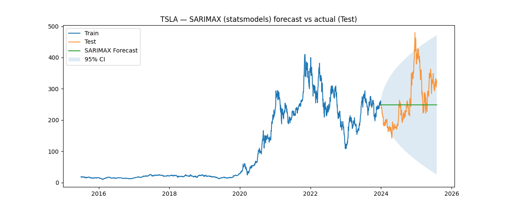
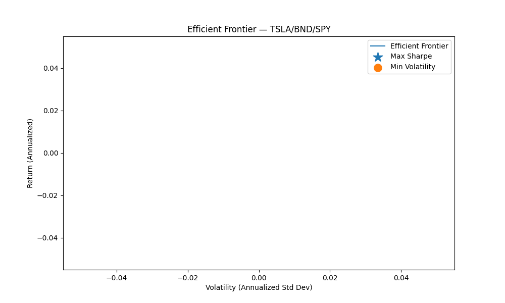
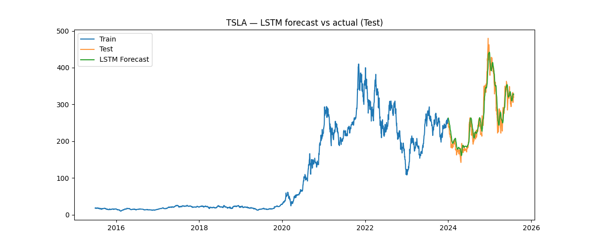
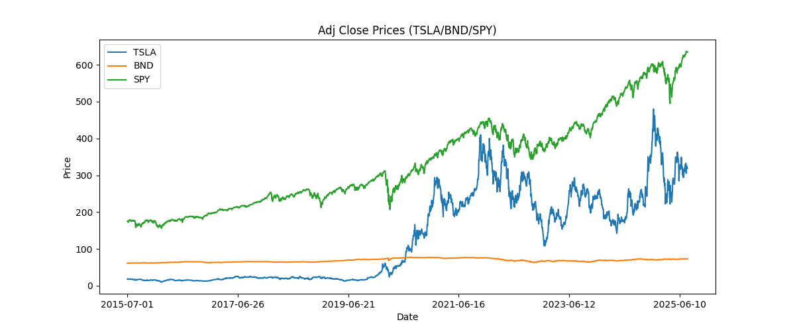
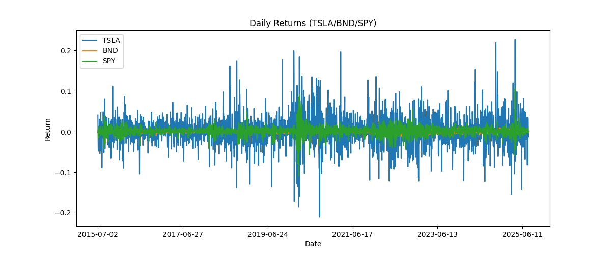
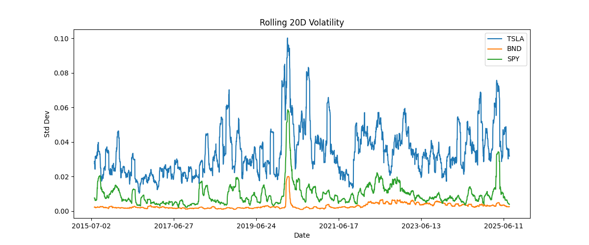
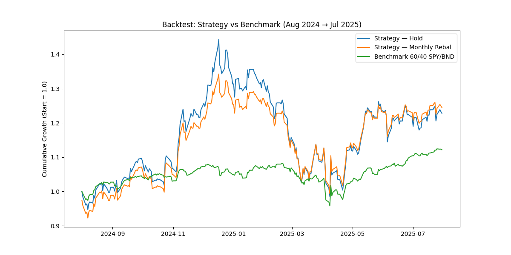
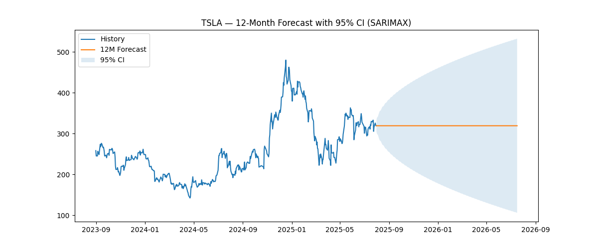

# GMF Time Series Forecasting & Portfolio Optimization

## Overview

This project implements time series forecasting and modern portfolio theory optimization for GMF Investments.  
It uses ARIMA and LSTM models to forecast TSLA prices and optimizes a TSLA/BND/SPY portfolio.

## Structure

- `data/` — datasets
- `notebooks/` — exploratory and modeling work
- `src/` — reusable Python scripts
- `reports/` — interim and final deliverables
- `outputs/` — plots, metrics, and models

## Setup

```bash
git clone https://github.com/MiskirB/gmf-time-series-portfolio-optimization.git
cd gmf-time-series-portfolio-optimization
pip install -r requirements.txt
```


# Final Project Report — GMF Time Series Portfolio Optimization

## 1. Introduction

This report presents the end-to-end analysis, modeling, portfolio optimization, and backtesting conducted for TSLA, BND, and SPY assets. The workflow includes exploratory data analysis, time series forecasting (SARIMAX and LSTM), portfolio optimization (Max Sharpe, Min Volatility), and backtesting against a benchmark strategy.

## 2. Task 1: Exploratory Data Analysis

- **TSLA**: {'VaR95': 0.054650328403958934, 'Sharpe_ann': 0.7781862633639587}
- **BND**: {'VaR95': 0.004896366624743271, 'Sharpe_ann': 0.3568075793343567}
- **SPY**: {'VaR95': 0.017168916309954818, 'Sharpe_ann': 0.7939152472407304}

## 3. Task 2: Time Series Modeling

- **ARIMA_statsmodels**: {'MAE': 63.725387631904425, 'RMSE': 79.00256803121906, 'MAPE': 24.172047470690774}
- **LSTM**: {'MAE': 15.588414781030096, 'RMSE': 20.17636321446875, 'MAPE': 6.1988299622168865}

## 4. TSLA 12-Month Forecast Expected Returns

- **expected_daily_return**: -2.3363607165527698e-07
- **expected_annual_return**: -5.88762900571298e-05

## 5. Task 4: Portfolio Optimization

- **assumptions**: {'expected_returns': {'TSLA': -5.88762900571298e-05, 'BND': nan, 'SPY': nan}, 'risk_free_rate': -5.98762900571298e-05, 'covariance_matrix_units': 'annualized'}
- **max_sharpe**: {'weights': {'TSLA': nan, 'BND': nan, 'SPY': nan}, 'expected_return': nan, 'volatility': nan, 'sharpe': nan}
- **min_volatility**: {'weights': {'TSLA': nan, 'BND': nan, 'SPY': nan}, 'expected_return': nan, 'volatility': nan, 'sharpe': nan}

## 6. Task 5: Backtesting Results

- **strategy_hold**: {'final_return': 0.22800615886317366, 'ann_vol': 0.3169210262006338, 'sharpe': 0.7874713790330776}
- **strategy_monthly**: {'final_return': 0.27726179748503954, 'ann_vol': 0.2848123982200804, 'sharpe': 0.9767601699887215}
- **benchmark_60_40**: {'final_return': 0.12172874817616619, 'ann_vol': 0.12150398723323233, 'sharpe': 0.9802563106611507}
- **window**: ['2024-08-01', '2025-07-31']

## 7. Conclusion

The project demonstrates the integration of statistical and deep learning models for forecasting, combined with portfolio theory to construct and evaluate investment strategies. Results show the comparative advantage of the optimized strategies over the benchmark.

## Visualizations
















